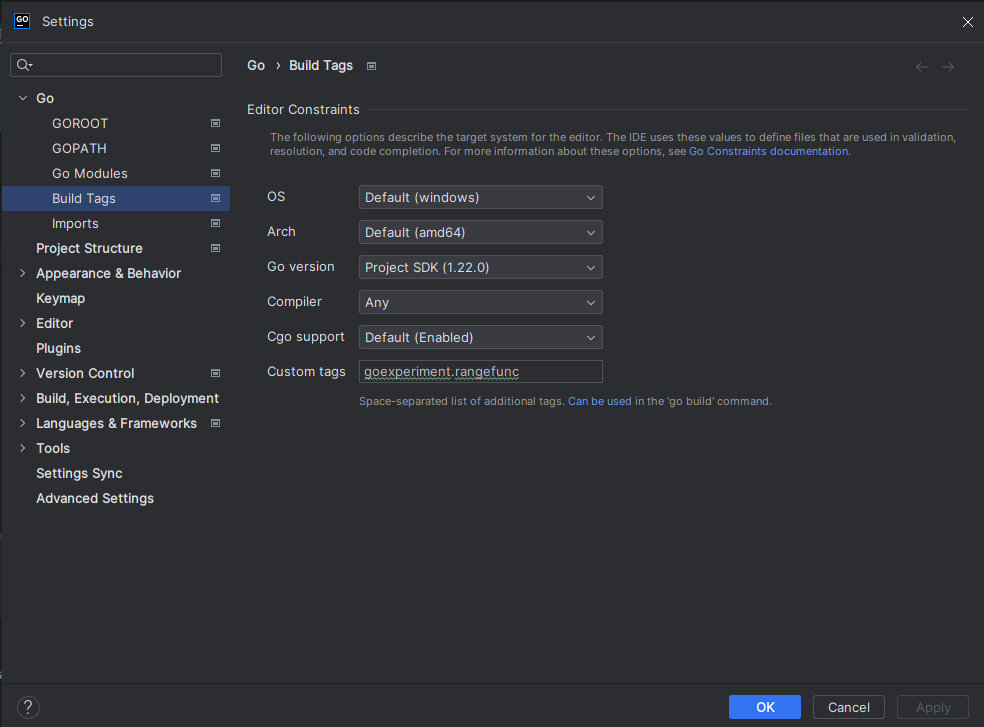
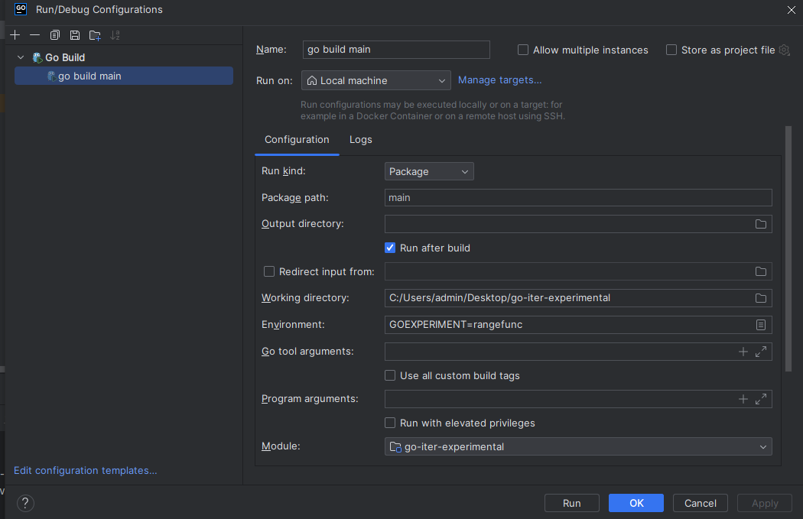
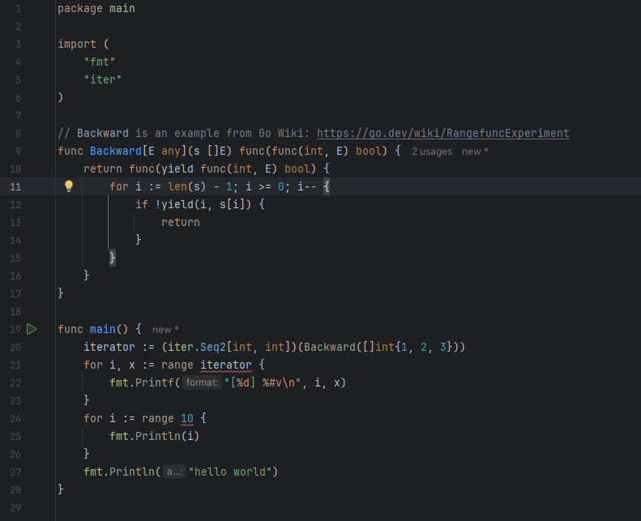

# GoLand

To remove red highlightings of `"iter"` package usage, you should go `ctrl+alt+S` -> `Go` -> `Build tags` and add `goexperiment.rangefunc` to `Custom tags` input: 

To build your application, you should add env variable: `GOEXPERIMENT=rangefunc` to launch configuration: 

Now you will see something like this and you can run it: 